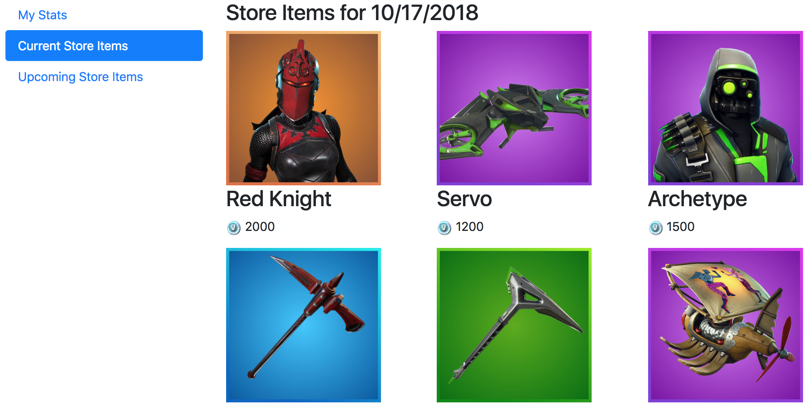
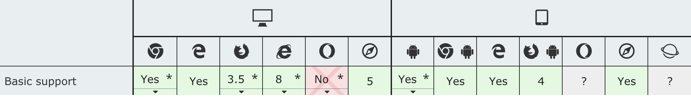
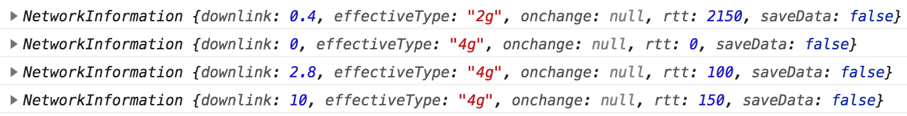
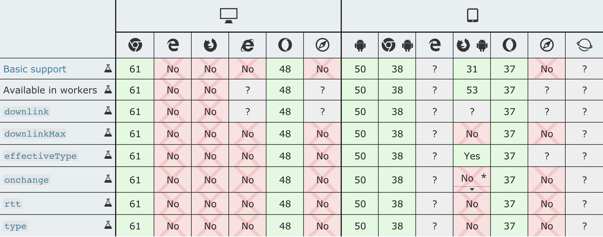

# Strategies for Offline Data in Web Apps


By Brian Rinaldi
@remotesynth

---


---

# What We'll Talk About

* Determininig online/offline status
* Storing simple and/or small amounts of data offline
* Storing complex and/or large amounts data offline
* Data synchronization strategies
* Libraries/tools that can help

---

# What We Won't Talk About

* PWAs and Service workers
* Asset caching and Cache API

---

# Let's Explore the Map


---

# Sample App



[https://github.com/remotesynth/offline-data](https://github.com/remotesynth/offline-data)

---

# Gather Your Weapons


* Navigator.onLine
* Network Information API

---

# Navigator.onLine


> Returns the online status of the browser.

---

# Navigator.onLine

```javascript
if (navigator.onLine)  {
	loadRemoteData();
}
else {
	loadLocalData();
}
```

---

# Navigator.onLine




---

# Network Information API


> The Network Information API provides information about the system's connection in terms of general connection type (e.g., 'wifi', 'cellular', etc.). This can be used to select high definition content or low definition content based on the user's connection.

---

# Network Information API

```javascript
var connection = navigator.connection
	|| navigator.mozConnection
	|| navigator.webkitConnection;
var type = connection.type;

function updateConnectionStatus() {
  console.log(connection);
}

connection.addEventListener('change', updateConnectionStatus);
```

---

# Network Information API




_[example on jsFiddle](https://jsfiddle.net/remotesynth/zd62ev94/3/)_

---

# Network Information API




---

# LocalStorage


---

# LocalStorage

* Key/Value store
* At least 5MB of data storage across all major web browsers
* Only holds strings (but you can store serialized data)
* Synchronous
* No built-in data protection - [do not store any sensitive information](https://www.rdegges.com/2018/please-stop-using-local-storage/)
* Best for maintaining state in an offline app

---

# LocalStorage

Storing simple strings:

```javascript
localStorage.setItem('platform', platform);

let platform = localStorage.getItem('platform');
```

---

# LocalStorage

Storing serialized JSON:

```javascript
let userdata  = JSON.parse(localStorage.getItem('userdata'));
```

---

# IndexedDb


---

# IndexedDb

* Asynchronous
* Optimized for storing large amounts of data
* Handles complex data
* Large storage limits (dynamic, dependent on disk space)
* Transactional

---

# IndexedDb

Creating the data store:

```javascript
let db;
let dbRequest = window.indexedDB.open("FNdb", 1);

dbRequest.onerror = function(event) {
  alert("Database error: " + event.target.errorCode);
};
dbRequest.onsuccess = function(event) {
  db = event.target.result;
};
dbRequest.onupgradeneeded = function(event) { 
  const db = event.target.result;

  let dailyStore = db.createObjectStore("DailyStoreItems", { keyPath : 'itemid' });
};
```

---

# IndexedDb

Adding data:

```javascript
const dailyStore = db.transaction(["DailyStoreItems"], "readwrite").objectStore("DailyStoreItems");

dailyStore.add(item); // add an item

dailyStore.put(item); // add or update an item
```

---

# IndexedDb

Getting data:

```javascript
const dailyStore = db.transaction(["DailyStoreItems"], "readwrite").objectStore("DailyStoreItems");

let getDailyStoreData = dailyStore.getAll();
getDailyStoreData.onsuccess = function(event) {
	// use the data in event.target.result
}
```

---
# Syncing Strategies


---
# Syncing Strategies

* Last in wins (most tools support this method as the default)
* Conflict detection/resolution

---
# Tools That Can Help

Let's loot some better weapons!


---

# Dexie

[dexie.org](http://dexie.org)

* Simplifies the IndexedDb API (promise based)
* Adds robust querying capabilities
* Enables syncing locally or externally via plugins
	* [dexie-syncable](http://dexie.org/docs/Syncable/Dexie.Syncable.js)
	* [sync-client](https://www.npmjs.com/package/sync-client)
	* [sync-server](https://www.npmjs.com/package/sync-server)

---

# Dexie

Create the data store:

```javascript
const db = new Dexie('FNdbDexie');
db.version(1).stores({
  items: '&itemid, requestDate, type'
});
```

---

# Dexie

Store data:

```javascript
db.items.add(item); // add an item
db.items.put(item); // add or update one item
db.items.bulkPut(items); // add or update an array of items
```

---

# Dexie

Query data:

```javascript
db.items.where('type').equalsIgnoreCase('upcoming').toArray((result) => {
	// work with the results
});

db.items.where('type').equalsIgnoreCase('upcoming').delete().then(()=>{
	\\ we easily cleared out data based on a column value
});
```

---

# PouchDB

[pouchdb.com](https://pouchdb.com/)

* JavaScript implementation of an [Apache CouchDB](http://couchdb.apache.org/)-like data store
* Uses IndexedDb by default (WebSQL adapter recently removed from the default build)
* CouchDB-like API for working with IndexedDb
* Provides convenience methods for syncing with an external CouchDB database
* Supports binary attachments

---

# PouchDB

Creating a local data store:

```javascript
const db = new PouchDB('FNdbPouch');
db.createIndex({
  index: {
    fields: ['type']
  }
});
```

---

# PouchDB

Store data:

```javascript
db.put(item).then((result)=>{
	\\ added a single item
});

db.bulkDocs(data.items).then((result)=>{
	\\ added items in bulk
});
```
---

# PouchDB

Querying data (relies on find plugin):

```javascript
db.find({selector: {type: 'upcoming'}}).then((result)=>{
	\\ work with the results
});
```

Does not support Dexie-like chaining of methods on queries.

---

# Kinvey

[progress.com/kinvey](https://www.progress.com/kinvey)

* Includes a MongoDB-based data store
* SDKs include built-in support for offline data (SDKs are [open source](https://github.com/Kinvey/js-sdk))
* Includes support for local and remote data syncing (granular control can be specified)
* Optimized for syncing large amounts of data (delta sync)

---

# Kinvey

Connecting to a data store:

```javascript
const client = Kinvey.init({
  appKey: 'mykey',
  appSecret: 'mysecret'
});
// create an anonymous user
const activeUser = Kinvey.User.getActiveUser(client);
if (!activeUser) {
  Kinvey.User.signup()
    .catch((error) => {
      console.log(error);
    });
}
```
---

# Kinvey

Add data to the data store:

```javascript
const dataStore = Kinvey.DataStore.collection('fortniteStore', Kinvey.DataStoreType.Sync);
dataStore.save(item).then(function onSuccess(entity) {
	// saved
}).catch(function onError(error) {
	// woops
});


dataStore.sync().then(() => {
	console.log('synced');
});
```
The sync type specifies that we want this data cached locally.

---

# Kinvey

No bulk saving. But we can delete based on a query.

```javascript
const dataStore = Kinvey.DataStore.collection('fortniteStore', Kinvey.DataStoreType.Sync);
const query = new Kinvey.Query();
query.equalTo('type','upcoming');

dataStore.remove(query).then(()=>{
	// items deleted
});
```

---

# Kinvey

Querying items:

```javascript
const dataStore = Kinvey.DataStore.collection('fortniteStore', Kinvey.DataStoreType.Sync);
const query = new Kinvey.Query();
query.equalTo('type','upcoming');
const stream = dataStore.find(query);
stream.subscribe(
	(items) => {
		// do something with the data
	},
	(error) => {
		// woops
	}
);
```

---

# Resources

Sample App:

* [https://github.com/remotesynth/offline-data](https://github.com/remotesynth/offline-data)

Other implementations:

* [Zango.db](https://github.com/erikolson186/zangodb) - MongoDb-like implementation
* [Workbox Background Sync](https://developers.google.com/web/tools/workbox/modules/workbox-background-sync) - handles retries when offline

---

# Questions

Twitter: @remotesyth
Email: brian.rinaldi@progress.com